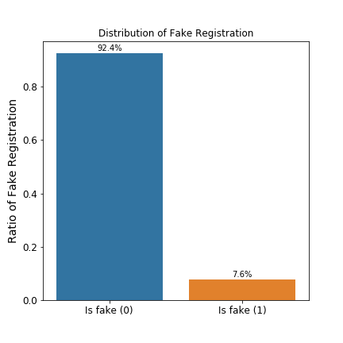
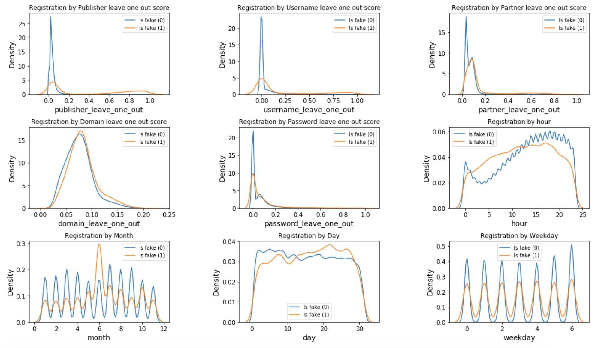
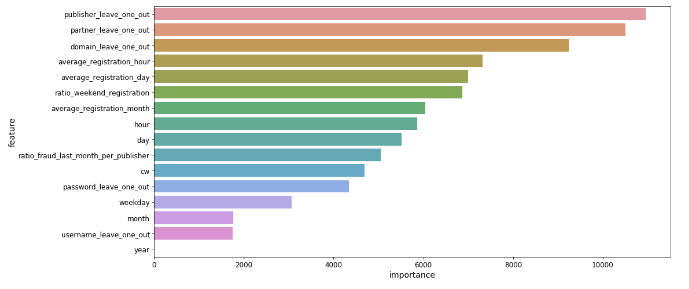

# Affiliate Network Fraud Detection Case Study

Build a model to classify users coming through the affiliate network in order to detect publishers’ fraud after registration. The publisher has an incentive to provide a fraud traffic since it gets compensated by the registrations.

This notebook intends to conduct an Exploratory Data Analysis (EDA) and perform a prediction modelling of publishers' fraud after registration.

## Scope of the submission

This submission contains the following files:

| File / Directory | Description |
| :----------------: | :-----------: |
| main.ipynb        | Python code used for the analysis. |
| images | directory containing plots used in this readme |
| data | directory where you need to download the dataset and put it here |
| README.md | the project documention |

## Data

*Note: All data provided in this file has been randomly created*

**IMPORTANT**

The dataset used is 1 million user registration records. In order to run the notebook, you need to download the data and put in the correct path. Here are the steps:

1. Download the data. I removed the download link here as the data source has not been published.

2. Put the dataset in the directory *data* and rename the file to *'test_dataset.csv'*.

Columns:

- User’s credentials (username and password ). Note: password is not hashed!
- Publisher: Whoever makes our advertising available on his website and display it to
visitors in order to receive a commission per registration.
- Partner: Affiliate Network acting as middle man for advertisers (us or our competitors)
to its publishers ­ webmasters, bloggers and any contributor that provides traffic
(visits to websites). Therefore, a publisher usually belongs to a certain partner.
- Domain: The product where the user made his registration
- Registration date and time
- is_fake: Decision whether the registered user is fraud or not based on certain
transaction which is considered to be human and not artificial (something similar to reCAPTCHA).

## Environment

The notebook used python 3.6.

The notebook used scientific packages: pandas, numpy, matplotlib, seaborn and lightgbm.

In order to use the lightgbm algorithms you can follow the instruction guide [here](http://lightgbm.readthedocs.io/en/latest/Installation-Guide.html) to install the LightGBM.

## Outline of Notebook

The notebook follows the general outline of machine learning projects:

1. Look at the Big Picture:
	- Frame the problem
	- Describe the data sources
	- Define performance metric: ROC_AUC
2. Get the Data
	- Import packages
	- Read the data
	- Take a Quick Look at the Data Structure
3. Prepare the Data
    - Handling categorical attributes
    - Handling missing values
    - Handling datetime
4. Exploratory Data Analysis 
	- Univariate Analysis 
	- Bivariate Analysis
		- Correlation and coefficient
		- Plotting
5. Feature Engineering
6. Train model
	- 6.1 RandomForestClassifier
		- Train model
		- Tune the model with GridSearchCV
		- Investigate feature importances
	- 6.2 ExtraTreesClassifier
    - 6.3 LightGBM
    
## Metric: ROC_AUC

The metric in this case is a common classification metric known as the [Receiver Operating Characteristic Area Under the Curve (ROC AUC)](https://stats.stackexchange.com/questions/132777/what-does-auc-stand-for-and-what-is-it).

The ROC curve graphs the true positive rate versus the false positive rate.

The [Area Under the Curve (AUC)](http://gim.unmc.edu/dxtests/roc3.htm) is the area under the ROC curve. This metric is between 0 and 1 with a better model scoring higher. A model that simply guesses at random will have a ROC AUC of 0.5.

## Prepare data

In the following some methods in the data preparation in this notebook.

#### Handling categorical attributes

This notebook will use the Owen Zhang's *[leave-one-out-encoding](https://www.kaggle.com/c/caterpillar-tube-pricing/discussion/15748)* to encode categorical features:
- username
- password
- publisher
- domain
- partner

#### Handling missing values

The notebook applies different strategic in handling categorical variables and numerical variables:
- For the missing categorical values, we will fill them with 'NaN' and treat them as a group.
- For the missing numerical values, we will use an imputer to imputer it with the median value.
	- As some of the value of categorical features might have only one row, which might result in NaN in the leave-one-out-encoding. For such cases, we will impute the missing values with median.

#### Handling datetime

To have a more detailed look at the time patterns, the notebook will transform the *register_datetime* to: hour, weekday, day, month, year, calener_week

## Exploratory Data Analysis

### Question 1: What is the distribution of the fake registration

There is about 7.6% of the fake registration.

### Question 2: What is the result of a univariate analysis

In this section, we look at the distribution of each attributes. With the univariate plotting, we can have an overview as following:

- **is_fake**: There is about 7.6% of the fake registration.
- **username**: There is some usernames used up to 200 times, like info or admin. The notebook would take a closer look at the bivariate analysis section about the relationship between username and the target.
- **password**: There is some password used up to 5k times. The notebook would take a closer look at the bivariate analysis section about the relationship between password and the target.
- **publisher**: The ratio_fake_registration by the top 10 publishers is compared to the overall relatively low. This could means that the fraud cases could happen more often by median/small publisher.
- **hour**: We can see some pattern in the hourly registration: The peak hour would be about 18 pm.
- **day**: The registration at the beginning of the month is relatively strong.
- **month**: The registration at the summer season is stronger than the winter season.
- **weekday**: The registration on the weekend is stronger than on the weekdays.
- **partner**: We can see that par_29 has almost 25% share of the registration.
- **domain**: We can see that some domain has been quite dominant in the share of registration: for example d_63_com, which has shared up to 40% of the registration.

### Question 3: What is the relationship between features and target detected?

The notebook uses Owen Zhang's *[leave-one-out-encoding](https://www.kaggle.com/c/caterpillar-tube-pricing/discussion/15748)* to encode categorical features. After the encoding, the notebook calculates the correlation coefficient and finds out the following relationships: 

- **publisher_leave_one_out**: According to the Pearson's correlation coefficient, *publisher* shows the strongest relationship with the target.
- **username_leave_one_out**: *Username* shows some relationship with the target.
- **partner_leave_one_out**: According to the Pearson's correlation coefficient, *partner* shows some relationship with the target.

### Question 4: What is the result of the bivariate analysis

The density plots show some patterns in the behavior of fake registration:

- From the plotting we can see that the feature **publisher** and **username** are a relatively strong feature to identify fraud.
- The **hourly hehavior** of fraud is also relatively different than none_fraud registration. We can see that a none_fraud registration would be more active during normal hours: from 10 am - 23 pm. Fraud registration would also prefer those hours in the mid-night to early morning.
- The **monthly behavior** also shows that a peak of June as fraud registration, whereas none_fraud registrations are quite equally distributed.
- The **behavior in the month** is also interesting. We can see that the fraud tends to be more active at the end of the month, whereas none_fraud registrations are more active at the beginning of the month.
- The **weekday** feature also shows some interesting patterns. For example: Fraud registration is distributed quite equally within the week, whereas the none_fraud registration would be more active on the weekends.

## Feature engineering

From the bivariate analysis, we see some time pattern in fraud behavior and publisher behavior, which gives us the insight to generate the feature on publisher level:

- ratio_fraud_last_month_per_publisher
- ratio_weekend_registration_per_publisher
- average_registration_hour_per_publisher
- average_registration_month_per_publisher
- average_registration_day_of_month_per_publisher

## Models and performance

The notebook split the data into training and testing set:
- training set: this includes the data from the beginning to the end of november.
- testing set: this includes the data in december.

The notebook has tried fit RandomForestClassifier, ExtraTreeClassifier and LightGBM to the training data and evaluate the performance on the testing data.

Best performance of each classifier as follows:

| Classifier | ROC_AUC on training set | ROC_AUC on testing set|
|:------------:|:-----------------------:|:-----------------------:|
|RandomForestClassifier | 0.994669 | 0.661106 |
|ExtraTreesClassifier | 1.00000 | 0.664926|
|LightGBM | 0.903921 | 0.749813 |

We can see that there is overfitting on the training set for each of the model above and there is still room for the model to improve by tuning the parameters. This notebook has not conducted a larger search of parameters however, due to the limitation of task time and limitation of machine performance.

LightGBM has somehow managed to reduced the overfitting and reaches the best score among all the models trained here. Let's save the lightGBM_clf as the final model.

## Features importance

The notebook compares the result of features importance between RandomForestClassifier and LightGBM. We can see quite much similarity among the top features between the lightGBM and RandomForestClassifier. As the LightGBM has reduced the overfitting on the training set and perform better on the testing set, we can regard that the feature_importance results from lightGBM more convincing.

We can see that the strongest feature is still *publisher_leave_one_out*. *partner_leave_one_out* has been the second strongest feature.

Other top 5 features include: *domain_leave_one_out*, *average_registration_hour*, *average_registration_day* / *ratio_weekend_registration*.

